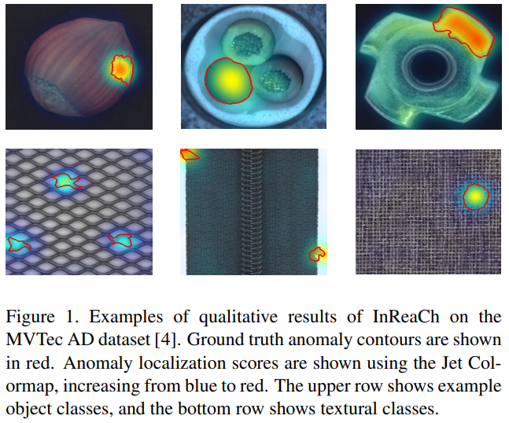
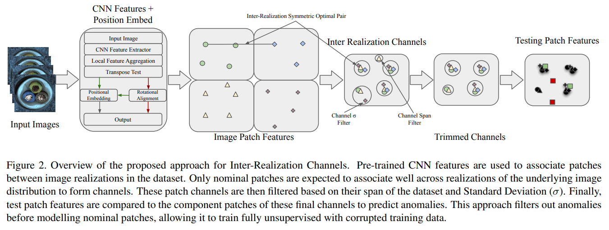
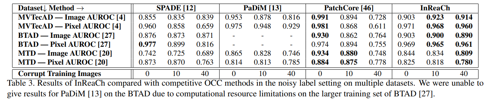

# Inter-Realization Channels: Unsupervised Anomaly Detection in Images Beyond One-Class Classification

This repository contains the code for an improved clarity and performance implementation of InReaCh from ICCV 2023.

Any questions or feedback or licencing please contact declanmcintosh@uvic.ca!

## Abstract 
Unsupervised anomaly detection and localization in images is a challenging problem, leading previous methods to attempt an easier supervised one-class classification formalization. 
Assuming training images to be realizations of the underlying image distribution, it follows that nominal patches from these realizations will be well associated between and represented across realizations.
From this, we propose Inter-Realization Channels (InReaCh), a fully unsupervised method of detecting and localizing anomalies. InReaCh extracts high-confidence nominal patches from training data by associating them between realizations into channels, only considering channels with high spans and low spread as nominal. We then create our nominal model from the patches of these channels to test new patches against. 
InReaCh extracts nominal patches from the MVTec AD dataset with 99.9% precision, then archives 0.968 AUROC in localization and 0.923 AUROC in detection with corrupted training data, competitive with current state-of-the-art supervised one-class classification methods. We test our model up to 40% of training data containing anomalies with negligibly affected performance. 
The shift to fully unsupervised training simplifies dataset creation and broadens possible applications.

## Tables and Figures





## Citing

If you use the code in this repository, please cite

```
@misc{mcintoshInReaCh,
      title={Inter-Realization Channels: Unsupervised Anomaly Detection in Images Beyond One-Class Classification},
      author={Declan McIntosh and Alexandra Branzan Albu},
      year={2023},
      booktitle = {Proceedings of the IEEE/CVF International Conference on Computer Vision (ICCV)},
      month     = {October}
}
```
